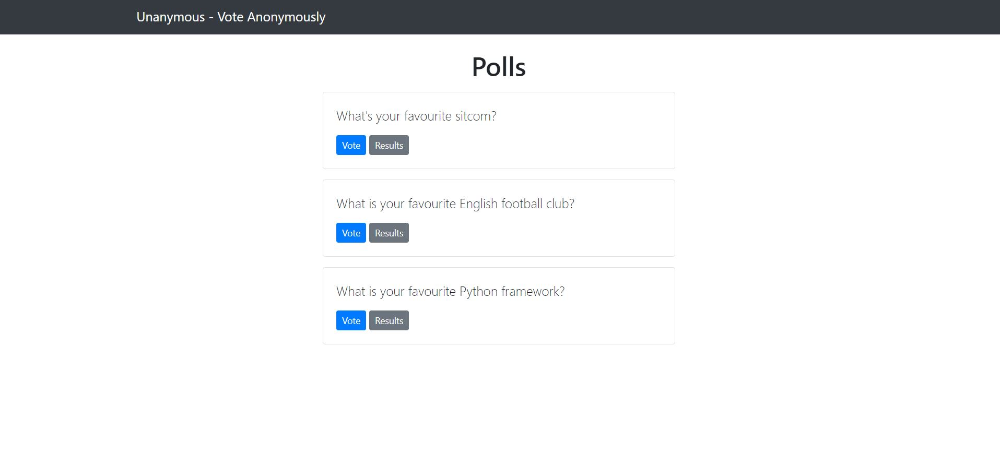
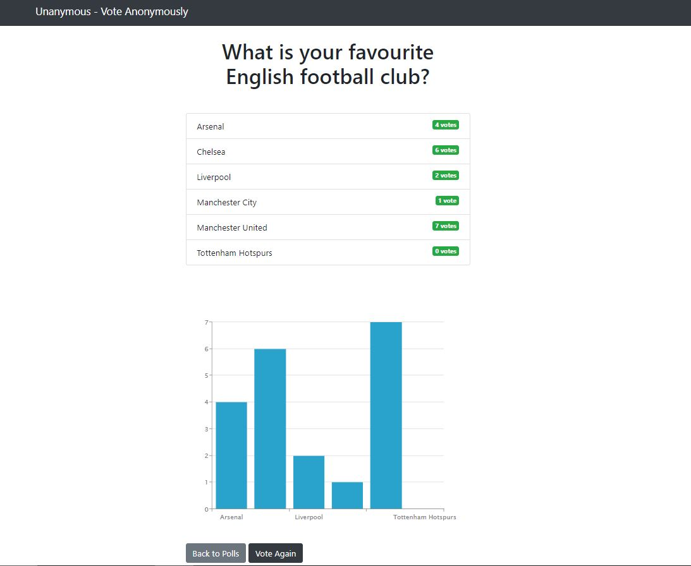

# Unanymous
A platform to create polls and vote anonymously.  
Built with Django to familiarize myself with the framework. 

## Tech Used
- Django for backend
- Bootstrap for frontend
- <a href="https://www.zingchart.com/" target="_blank">Zingcharts</a> for graphing

## Screenshots
<p float="left">


</p>

## Quick Start

``` bash
# Install dependencies
pipenv install

cd unanymous

# Serve on localhost:8000
python manage.py runserver
```
To add new questions/choices, login as the admin at localhost:8000/admin to access the Django admin area. 
